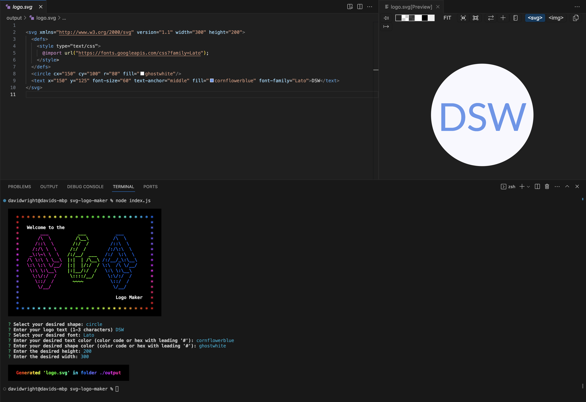
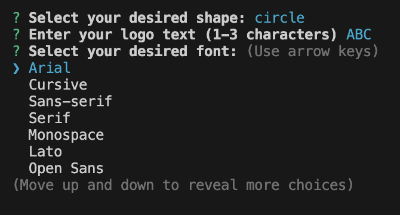

# SVG Logo Maker

## Description [](https://opensource.org/licenses/MIT)

This command-line application generates an SVG logo based on simple user input. It uses node fs to write files, and the npm inquirer package to provide user prompts and command-line input. This project gave me an excellent opportunity to learn more about constructors, and in particular using child constructors that inherit common properties and methods from their parent, as the logos are generated using three primary shapes. I used these constructors to create an SVG file that would fulfil the user's desired specifications for shape, shape color, text, text color, text content, and font. The result is saved in the file 'logo.svg'.

Additionally, I created a suite of automated tests to verify the correct functioning of the shapes constructors Circle, Square, and Triangle.

A screenshot of the application and its output is shown below.




## Table of Contents
  
* [Installation](#installation)
* [Usage](#usage)
* [Tests](#tests)
* [Credits](#credits)
* [License](#license)


## Installation

Run the following command to install dependencies:

```
npm install
```

A screenshot of successful installation is presented below.


## Usage 

Use the following command to run the application:

```
node index.js
```

Provide a text, text color, font, shape, and shape color input in response to the command-line prompts. The new file logo.svg will be generated in the 'outputs' folder.

A video walkthrough can be found [here](https://watch.screencastify.com/v/j08ayp0ClfJ7Y4tPykDY).

Font selection is shown below.



Shape selection is shown below.


## Tests

Run the following command to run tests:

```
npm test
```

A video walkthrough showing successful tests can be found [here](https://watch.screencastify.com/v/W3chzSRmdfOGFJESWT2M).

A screenshot of successful tests is shown below.


## Credits

I used [inquirer 8.2.4](https://www.npmjs.com/package/inquirer/v/8.2.4) for command-line user prompts and response input.

I used [chalk 4.1.2](https://www.npmjs.com/package/chalk/v/4.1.2) for command-line text formatting.

ASCII art leters were created with the [ASCII Art Generator](https://ascii.mastervb.net/text_to_ascii.php).

[ChatGPT](https://chat.openai.com/) created an object for me with all 140 HTML named colors and their HEX values.

I got ideas on how to validate HEX color input from [GeeksforGeeks](https://www.geeksforgeeks.org/), [Check if a string represents a hexadecimal number or not](https://www.geeksforgeeks.org/check-if-a-string-represents-a-hexadecimal-number-or-not/#).


## License

This project is licensed under the terms of the MIT License.

Detailed information about this license can be found [here](https://choosealicense.com/licenses/mit/).

---
